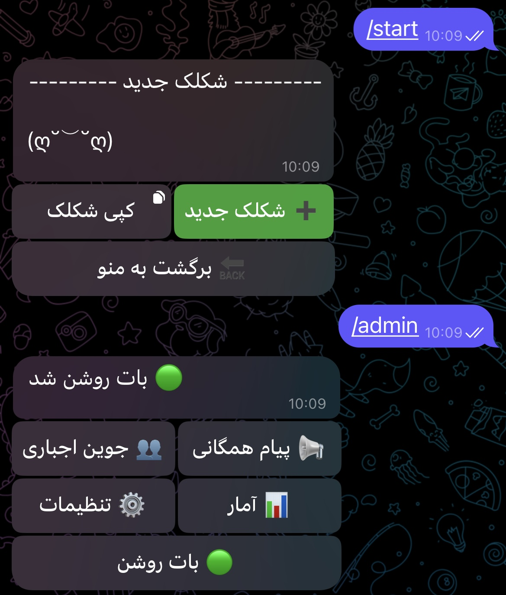
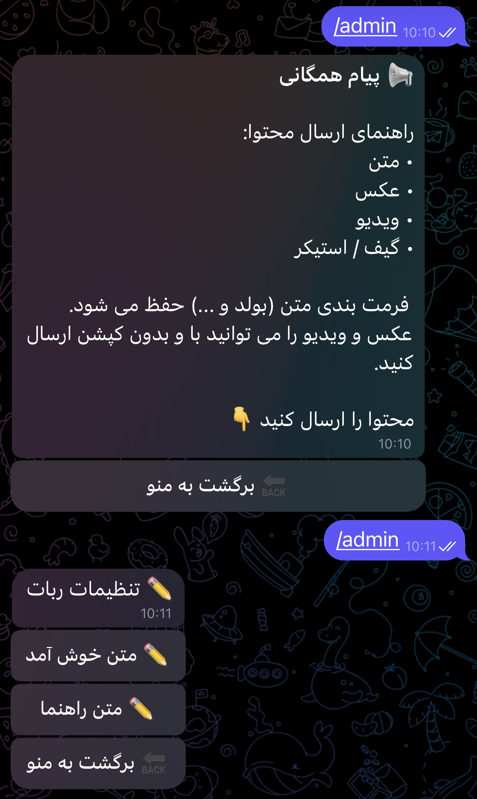
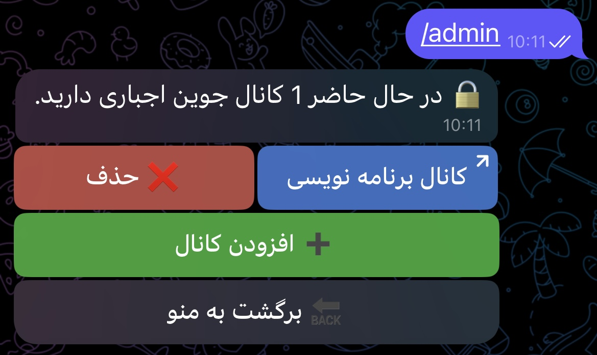

# 🤖 ASCII Faces Telegram Bot Showcase

A simple and lightweight Telegram bot that provides a collection of ASCII faces 
and text emoticons with a clean and user-friendly interface.

## 🎥 Demo

## 📸 Screenshots

     
     
    

## ✨ Features

- Browse a collection of ASCII faces.
- One-tap copy and send.
- Fast and lightweight.
- Clean inline keyboard interface.
- Fully asynchronous.
- Easy to extend with new faces.

## 🛠️ Tech Stack

- Python 3
- python-telegram-bot
